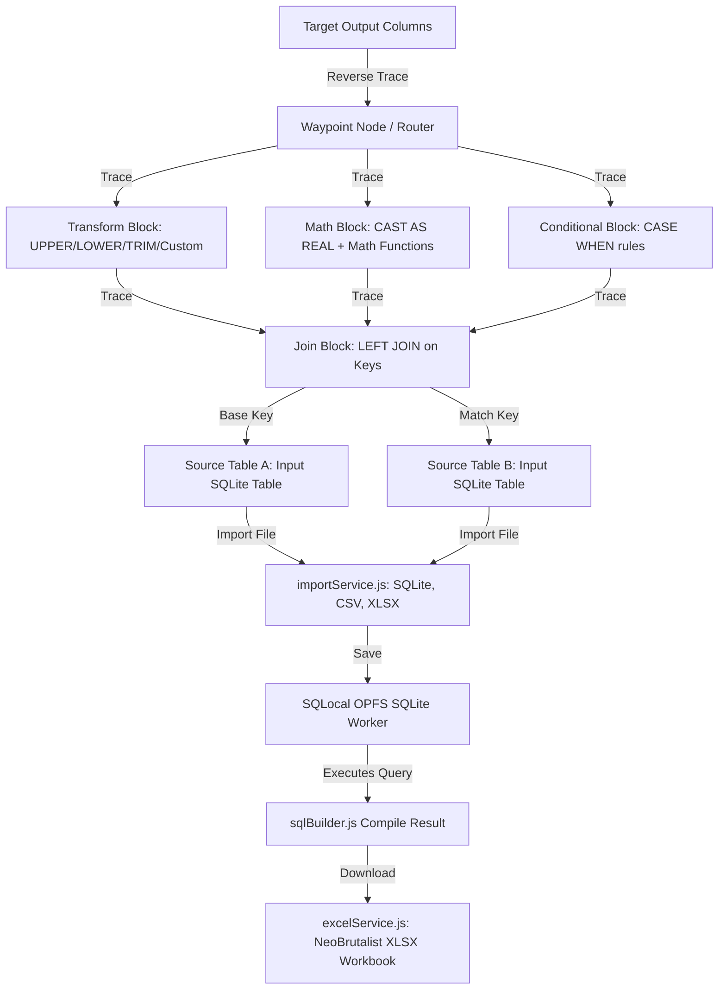

# EggShell — Visual Relational Data Pipeline Builder

EggShell (also referred to as **Excel Stitcher** or **Melder**) is a local-first, visual database pipeline workspace designed to stitch, merge, and clean spreadsheet data. Unlike traditional spreadsheet programs that crash or lag under heavy workloads, EggShell leverages an in-browser SQLite database running in a Web Worker, providing a visual node-based editor to define data pipelines.

---

## 🚀 Key Features

*   **SQLite-Powered Engine**: Backed by a high-performance SQLite database running client-side via `sqlocal` and `sql.js` in a Web Worker with OPFS (Origin Private File System). Easily handles hundreds of thousands of rows with zero browser crashes or server lag.
*   **Visual DAG Pipeline Canvas**: Drag, drop, and wire datasets visually on a canvas powered by `@xyflow/react` (React Flow). Connect input spreadsheet columns to transformations, joins, and filters, ending at target output schemas.
*   **Visual Data Operators**:
    *   **Transform Block**: Capitalize texts (`UPPERCASE`, `lowercase`), remove leading/trailing spaces (`TRIM`), generate index/row counts (`SERIAL_NO`), or run customized SQLite string operations.
    *   **Math Block**: Build arithmetic queries (`+`, `-`, `*`, `/`), calculate trigonometric or logarithmic equations, reference numeric column handles, insert constants (`pi`, `e`), and round outputs to a specified decimal precision.
    *   **Conditional Block (If-Else)**: Visual builder to compile nested `CASE WHEN ... THEN ... ELSE ... END` statements based on string matching or numerical logic.
    *   **Filter Block**: Filter row records visually using custom SQLite `WHERE` clause definitions.
    *   **Join Block**: Wire two spreadsheet tables together through key fields using a fast, case-insensitive, auto-trimmed `LEFT JOIN`.
    *   **Waypoint Node**: Clean visual joints that act as routing points to organize messy connector lines.
*   **Standalone Grid Editor**: A secondary grid editing viewport to perform database CRUD operations, insert rows, delete records, rename/move columns, or completely reset data to its original backup.
*   **Live Preview Monitor**: A real-time data preview monitor showing live-rendered database queries with custom column sorting, order re-arrangement, and export tools.
*   **Multi-Format Exporting**: Save stitched tables back as formatted Multi-Sheet Excel Workbooks (`exceljs`), standard CSVs (`papaparse`), standalone SQLite databases (`.db`/`.sqlite3`), or plain SQL dump scripts.
*   **AI-Assisted Scripting**: One-click schema exporter that copies active workspace database schemas to your clipboard, allowing you to feed it directly to LLMs (Gemini, Claude, ChatGPT) to auto-generate JSON configuration maps or complex SQLite scripts.
*   **100% Client-Side Privacy**: Runs completely inside the browser. No spreadsheets are ever uploaded to external servers, guaranteeing total data security and privacy.

---

## 📁 Repository Structure

The project workspace is divided into the core application client and test data scripts:

```
excel-stitcher/
├── excelSticher/                   # Core React + Vite Web Application
│   ├── public/                     # Static client assets
│   ├── src/
│   │   ├── components/
│   │   │   ├── canvas/             # React Flow nodes (Source, Output, Transform, Math, Join, Waypoint) & Modals
│   │   │   │   └── blocks/         # Specific Node configuration inspector drawers (Join, Math, Transform, etc.)
│   │   │   └── ui/                 # Reusable UI widgets (e.g. Modals)
│   │   ├── context/
│   │   │   ├── ProjectContext.jsx  # Global React state server tracking files, nodes, edges, and connection helpers
│   │   │   ├── canvasEngine.js     # Path traversals, sub-graph duplications, and auto-arrange layout engines
│   │   │   └── configCompiler.js   # Exporters & compilers mapping visual DAGs to file-agnostic JSON structures
│   │   ├── hooks/
│   │   │   └── useSqlite.js        # React hook wrapper interfacing with the OPFS Web Worker SQLite connection
│   │   ├── pages/
│   │   │   ├── workspace/          # Main Canvas pipeline layout (Sidebar, Data Preview, Tutorial Drawer)
│   │   │   ├── editor/             # Standalone spreadsheet-like table editor (CRUD, reorder, rename)
│   │   │   └── preview/            # Live query results preview panel & data export panel
│   │   ├── services/
│   │   │   ├── db.js               # Instantiates the SQLocal OPFS SQLite connection
│   │   │   ├── importService.js    # Standardizes and imports CSVs, XLSXs, and DB files into SQLite
│   │   │   ├── excelService.js     # Generates styled Neobrutalist Excel sheets for download
│   │   │   └── sqlBuilder.js       # The Visual Compiler translating connected nodes/edges into cohesive SQL queries
│   │   ├── utils/
│   │   │   └── helpers.js          # Unicode-safe database column name sanitization helpers
│   │   ├── App.jsx                 # Routes application viewports (workspace, editor, preview) based on query parameters
│   │   └── main.jsx                # React App entry point
│   ├── package.json                # Dependencies (@xyflow/react, exceljs, sqlocal, sql.js, papaparse, lucide-react)
│   └── vite.config.js              # Vite configuration
│
├── test-data-generator/            # Python testing data pipeline
│   ├── generate.py                 # Generates mock multi-sheet Excel files with mismatched casing, spaces, and shapes
│   ├── requirements.txt            # Python dependencies (openpyxl)
│   └── student_pipeline_config.json# Example pipeline configuration to test import compatibility
│
└── output_test_files/              # Destination directory for files generated by the Python test script
```

---

## 🔄 Visual Query Compilation Pipeline

The visual-to-SQL compiler (`sqlBuilder.js`) performs a reverse trace to construct the query:



1. **Schema Injection**: Spreadsheets are imported through `importService.js`, sanitized to safe database formats, and populated inside the private OPFS database tables.
2. **Reverse Trace Resolution**: `sqlBuilder.js` starts from the connected headers of `OutputNode` and traverses upstream to compile parent operations (`Transform`, `Math`, `Join`, `Condition`, `Filter`).
3. **Joins & Filters Registration**: Relational joints are compiled into `LEFT JOIN` structures, and filter criteria are compiled into `WHERE` clauses.
4. **Proxy Query Execution**: The compiled query is sent over a React context connection to the SQLite database. Results are fetched asynchronously and loaded inside the live data preview.

---

## 🛠️ Getting Started

### 1. Generating Mock Test Files
First, populate mock data sheets containing spelling variances, casing gaps, and structural differences to test EggShell's pipeline features:

```bash
cd test-data-generator
# Install dependencies
pip install -r requirements.txt
# Run generator
python generate.py
```
This saves test spreadsheets (marks, rosters, attendance data) in the `output_test_files/` directory.

### 2. Launching the Web Application
Next, launch EggShell's development workspace:

```bash
cd excelSticher
# Install dependencies
pnpm install # or npm install / yarn install
# Run development server
pnpm dev
```
Open [http://localhost:5173](http://localhost:5173) in your browser.

---

## 📖 Recommended Workflow

1. **Import Source Sheets**: Import the generated Excel sheets from the `output_test_files/` folder (e.g. rosters, marks, attendance rosters).
2. **Setup Output Layout**: Add a target Output Node and define the column layout you want to produce.
3. **Wire Columns**: Drag connections from source table columns, route them through **Transform** blocks to standardize casing/trim spaces, **Math** blocks to aggregate scores, or **Join** blocks to align matching keys, and finally wire them to your Output layout columns.
4. **Validate Results**: View the compiled query output inside the **Stitcher Preview Monitor** to verify rows are merging and mapping correctly.
5. **Download Export**: Click **Export** to save your stitched file as a finished spreadsheet or SQLite database!

